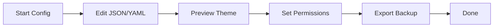

## Overview

Configure Samosa to align with your project's identity and workflow. Adjust themes, set brand colors like the default `#3B82F6`, manage user permissions, and handle export/import for backups or migrations. These settings ensure your documentation feels native to your brand.

<Columns cols="3">
  <Card title="Themes & Layouts" href="#themes" icon="palette" horizontal="false">
    Switch between light/dark modes and layouts.
  </Card>

  <Card title="Branding" href="#branding" icon="brush" horizontal="false">
    Customize colors and logos.
  </Card>

  <Card title="Permissions" href="#permissions" icon="users" horizontal="false">
    Control access levels.
  </Card>

  <Card title="Export/Import" href="#export" icon="upload" horizontal="false">
    Backup or migrate content.
  </Card>
</Columns>

## Theme and Layout Options

Choose from predefined themes or create custom ones. Samosa supports light, dark, and auto modes, plus layout variants like sidebar or full-width.

<Steps>
  <Step title="Access Settings" icon="settings" title-type="p">
    Navigate to **Project Settings** > **Appearance**.
  </Step>

  <Step title="Select Theme" icon="palette" title-type="p">
    Pick a theme from the dropdown.
  </Step>

  <Step title="Preview Changes" icon="eye" title-type="p">
    Toggle preview to see live updates.
  </Step>

  <Step title="Save" icon="save" title-type="p">
    Apply changes across your space.
  </Step>
</Steps>

<Tabs>
  <Tab title="JSON Config" icon="code">
    Edit `samosa.config.json` directly:

    ```json
    {
      "theme": {
        "mode": "dark",
        "layout": "sidebar"
      }
    }
    ```
  </Tab>

  <Tab title="YAML Config" icon="file-text">
    Use YAML for `samosa.config.yaml`:

    ```yaml
    theme:
      mode: light
      layout: full-width
    ```
  </Tab>
</Tabs>

<Callout kind="tip" collapsed="false">
  Auto mode detects user preference via `prefers-color-scheme`.
</Callout>

## Brand Color Customization

Override the default `#3B82F6` primary color to match your brand. Apply it to buttons, links, and accents.

```javascript
// In samosa.config.json
{
  "branding": {
    "primaryColor": "#10B981",
    "logoUrl": "https://your-domain.com/logo.svg"
  }
}
```

Test colors with the built-in palette picker in settings. Changes propagate instantly without rebuilds.

## User Permissions

Define roles to secure your documentation. Use granular controls for read, write, and admin access.

| Role   | Read | Write | Admin | Delete |
| ------ | ---- | ----- | ----- | ------ |
| Viewer | ✅    | ❌     | ❌     | ❌      |
| Editor | ✅    | ✅     | ❌     | ❌      |
| Admin  | ✅    | ✅     | ✅     | ✅      |

<Expandable title="Advanced Permissions" default-open="false">
  Configure via API or config file:

  ```json
  {
    "permissions": {
      "roles": [
        {
          "name": "editor",
          "scopes": ["read", "write"]
        }
      ]
    }
  }
  ```

  Invite users by email in the **Team** tab.
</Expandable>

## Export and Import Settings

Backup your space or migrate to another instance. Exports include MDX pages, assets, and configs.

<CodeGroup show-lines="true" tabs={[]}>
  ```bash
  # Export via CLI
  samosa export --output ./backup.zip --include-assets
  ```

  ```bash
  # Import via CLI
  samosa import ./backup.zip --overwrite
  ```
</CodeGroup>

In the UI, go to **Settings** > **Export** to download a ZIP. For imports, upload via the same panel.

<Callout kind="warning" collapsed="false">
  Exports exclude sensitive data like API keys. Review `samosa.config.json` separately.
</Callout>



These configurations make Samosa adaptable to any project scale. Start with themes for quick wins, then refine permissions as your team grows.
