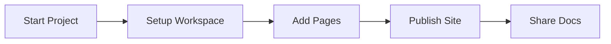

## Overview

Samosa provides your default documentation space. You organize and manage all project documentation here with ease. Leverage powerful MDX components, version control, and search to create professional docs.

<Columns cols={3}>
  <Card title="Rich Components" icon="components" href="/docs/components">
    Build engaging pages with `<Callout>`, `<Steps>`, `<Tabs>`, and more.
  </Card>
  <Card title="Versioned Docs" icon="git-branch" href="/docs/versions">
    Maintain multiple versions and changelog with `<Update>` components.
  </Card>
  <Card title="Search & Navigation" icon="search" href="/docs/search">
    Enable full-text search and intuitive sidebar navigation.
  </Card>
</Columns>

## Key Benefits

You gain several advantages with Samosa:

- **Centralized Management**: Store all docs in one space with folders and tags.
- **MDX Superpowers**: Write in Markdown with JSX components for interactive content.
- **Collaboration**: Share edit access and track changes via Git integration.
- **Customizable**: Theme with your brand colors like `#3B82F6`.

<Callout kind="tip">
  Customize your theme by setting primary color to `#3B82F6` in site config for a branded look.
</Callout>

## Getting Started

Follow these steps to set up your first documentation site.

<Steps>
  <Step title="Create Account" icon="user-plus">
    Sign up at `https://app.samosa-docs.com` with your email.
  </Step>
  <Step title="New Workspace" icon="plus">
    Click **New Workspace** and name it `my-project-docs`.
  </Step>
  <Step title="Add First Page" icon="file-plus">
    Create `introduction.mdx` and add frontmatter with `title` and `description`.
  </Step>
  <Step title="Publish" icon="globe">
    Deploy to a custom domain like `docs.myproject.com`.
  </Step>
</Steps>

For code setup, initialize your docs repo:

<CodeGroup tabs="npm,yarn">
  ```bash
  npm init samosa-docs@latest my-docs
  cd my-docs
  npm run dev
  ```
  ```bash
  yarn create samosa-docs my-docs
  cd my-docs
  yarn dev
  ```
</CodeGroup>

## Support Resources

Access help through multiple channels.

<Tabs>
  <Tab title="Documentation" icon="book-open">
    Explore full guides at `/docs`.

    <Expandable title="Advanced Topics" default-open="false">
      Dive into custom components and API integrations.
    </Expandable>
  </Tab>
  <Tab title="Community" icon="users">
    Join Discord: `https://discord.gg/samosa-docs`.
  </Tab>
  <Tab title="GitHub" icon="github">
    Report issues: `https://github.com/samosa-docs/platform`.
  </Tab>
</Tabs>



You now have everything to build comprehensive documentation. Start creating pages today!