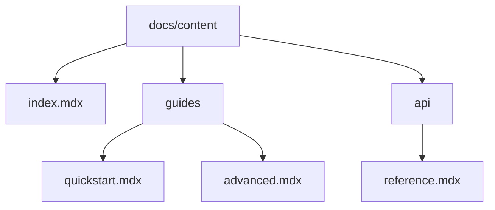

## Overview

Samosa provides a flexible system for building and maintaining your project's documentation. You create pages using MDX, organize them into a navigable structure, collaborate with your team, and track changes with version control. Start by familiarizing yourself with the editor and file-based organization.

<Callout kind="tip">

Organize pages into folders matching your sidebar navigation for automatic structure generation.

</Callout>

## Creating and Editing Pages

Use the built-in editor or your preferred IDE to manage content. All pages are MDX files stored in your repository.

<Steps>
  <Step title="Create a New Page" icon="plus">
    Navigate to your `docs/content/` directory. Create a new file like `features/new-feature.mdx`.

    Add frontmatter at the top:

    ```mdx
    ---
    title: New Feature
    description: Details about the new feature.
    ---
    ```

    Write your content starting with `## Overview`.
  </Step>
  <Step title="Edit Existing Pages" icon="edit-3">
    Open any `.mdx` file in the editor. Make changes and preview locally with `npm run dev`.
  </Step>
  <Step title="Preview Changes" icon="eye">
    Run `npm run build` to generate the static site and test navigation.
  </Step>
</Steps>

## Organizing Documentation Structure

Structure your docs hierarchically using folders and frontmatter. Samosa auto-generates sidebars from your file tree.

| Structure Type | Description | Example Path |
| -------------- | ----------- | ------------ |
| Top-level pages | Entry points like home or intro | `docs/content/index.mdx` |
| Nested sections | Group related topics | `docs/content/api/reference.mdx` |
| Sidebar groups | Use `_category_.json` for custom labels | `docs/content/guides/_category_.json` |

<Columns cols={2}>
  <Card title="Folder-Based Navigation" icon="folder" href="/docs/content-structure">
    Mirror your folder structure for intuitive navigation. Folders become sidebar sections automatically.
  </Card>
  <Card title="Custom Sidebar Config" icon="settings" href="/docs/sidebar-config">
    Override defaults with JSON files for grouped or labeled sections.
  </Card>
</Columns>



## Collaboration Features

Invite team members to your Samosa space and use pull requests for reviews. Changes sync automatically on merge.

<Tabs>
  <Tab title="GitHub" icon="github">
    Connect your repo to enable PR previews. Reviewers comment inline on MDX files.

    <CodeGroup tabs="CLI,Web">
      ```bash
      git checkout -b feature/new-docs
      git add docs/content/new-page.mdx
      git commit -m "Add new page"
      git push origin feature/new-docs
      ```
      ```mdx
      <!-- In GitHub PR: Approve and merge to deploy -->
      ```
    </CodeGroup>
  </Tab>
  <Tab title="Internal Reviews" icon="users">
    Use Samosa's review workflows. Assign reviewers and resolve feedback before publishing.
  </Tab>
</Tabs>

## Version Control Basics

Track changes with Git integration. Each commit creates a versioned history.

<Steps>
  <Step title="Branch for Changes" icon="git-branch">
    Create a feature branch: `git checkout -b docs-update`.
  </Step>
  <Step title="Commit and Push" icon="git-commit">
    Commit atomic changes: `git commit -m "Update collaboration section"`.
  </Step>
  <Step title="Merge via PR" icon="git-pull-request">
    Open a PR, get approvals, and merge to main for deployment.
  </Step>
</Steps>

<ExpandableGroup>
  <Expandable title="Advanced Git Workflows" default-open="false">
    Use tags for releases: `git tag v1.0.0` and `git push --tags`. Revert with `git revert <commit-hash>`.
  </Expandable>
</ExpandableGroup>

<Callout kind="info">

Enable protected branches in your repo settings to require reviews on main.

</Callout>